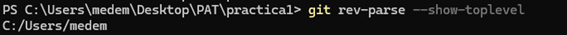

**Práctica 1**

Para empezar quería comentar que tenía un problema de primeras con el
git, puesto que ya había utilizado esta herramienta en otra asignatura.

Al clonar mi repositorio encontraba que al hacer un add o un commit
quería añadir todos los archivos de mi ordenador.

Esto ocurría porque tenía mi carpeta .git en una carpeta muy alta, como
se puede ver en la siguiente imagen.

Lo he solucionado eliminando esta carpeta .git y colando de nuevo el
repositorio en mi carpeta de practica1

[**git clone**:]{.underline} git clone crea en una copia local de un
repositorio en remoto, en este caso del repositorio que he creado,
llamado PAT_1, después de hacer un fork desde el repositorio del
profesor.

**[git branch / git checkout :]{.underline}** Hago uso del comando git
Branch para crear una nueva rama de desarrollo; esto servirá para poder
desempeñar el desarrollo de nuevas versiones para el proyecto de forma
paralela. Para acceder a esta rama hago git checkout.

El comando **[git checkout]{.underline}** servirá para cambiar entre
ramas en local.

El comando **[git fetch]{.underline}** descarga actualizaciones desde el
repositorio remoto (como nuevas ramas, commits, etiquetas, etc.) al
repositorio local sin fusionarlas automáticamente con tu rama activa.
Esto permite revisar los cambios remotos antes de aplicarlos. Aquí pongo
dos capturas como ejemplo de un proyecto de desarrollo en el que hacemos
uso de github; podemos ver como antes de hacer el fetch, en local,
aparece un histórico de commits muy distinto al de la captura siguiente,
justo después de hacer un fetch.

Ya hemos comprobado que el entorno git funciona en mi PC; vamos a
practicar el commit y el push en mi entorno de desarrollo; en IntelliJ.

Ya en mi entorno de desarrollo, he creado un fichero de texto de prueba
para hacer mi primer **[git add, git commit y git push.]{.underline}**

**[git add, git commit y git push:]{.underline}** Como podemos ver en
las siguientes capturas, he subido a mi rama prueba (esto para
posteriormente hacer un pull request y merge),

**[git add]{.underline}** es un comando que añade archivos al área de
preparación, preparación para ser incluidos en el próximo commit.

El comando **[git commit]{.underline}** guarda los cambios del área de
preparación (*staging area*) en el historial del repositorio, creando un
punto de referencia con un mensaje descriptivo que detalla los cambios
realizados.

El comando **[git push]{.underline}** se utiliza para subir los commits
del repositorio local al repositorio remoto, sincronizando los cambios
realizados en tu máquina con el servidor remoto.

Si accedemos a el repositorio desde el navegador comprobamos que
efectivamente, se ha subido el contenido.

Si concluimos que ya hemos acabado con el desarrollo en paralelo en
nuestra rama, podemos hacer un **[pull request]{.underline}**. Es una
solicitud para que los cambios realizados en una rama (generalmente una
rama de trabajo) sean revisados, discutidos y, eventualmente, fusionados
con otra rama (por lo general, la rama principal como main o master).
Que en este caso como no tengo permisos, no puedo aceptarlo y fusionar
las ramas.

Otra parte de la práctica es comprobar que tenga instalados tanto Maven como Java. Vemos que sí en las siguientes capturas. (Ya lo tenía de anteriores proyectos)

